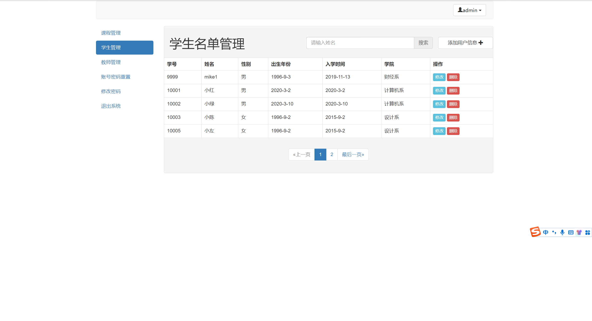
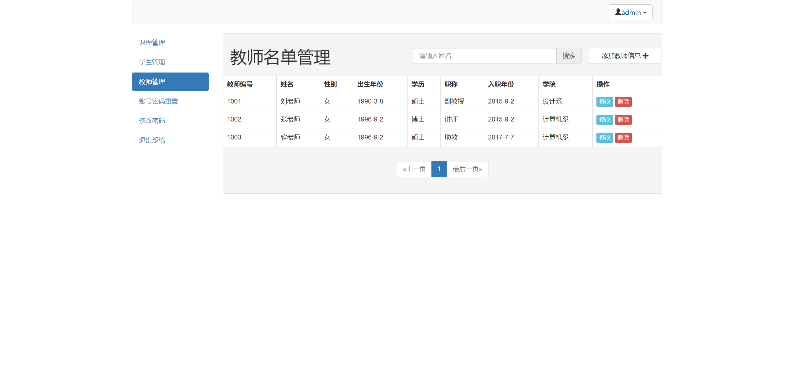
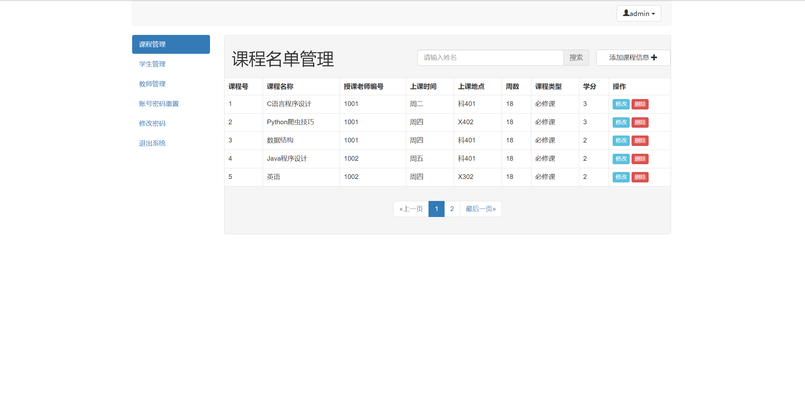
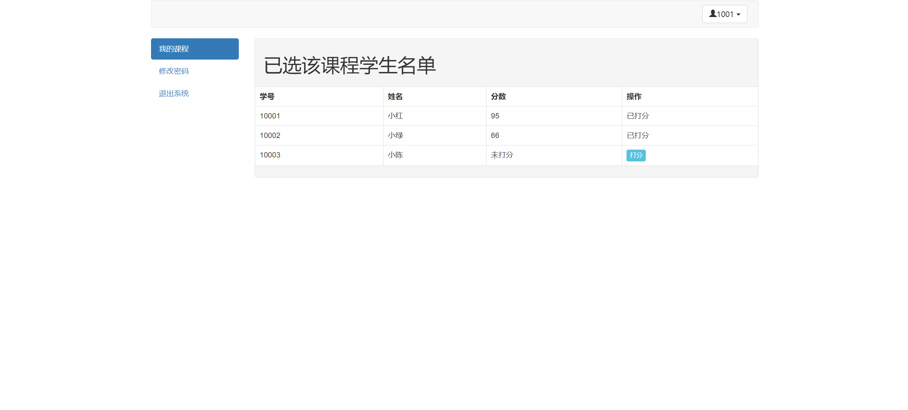
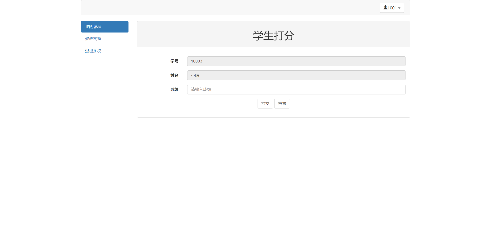
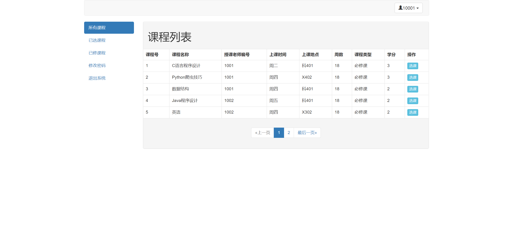
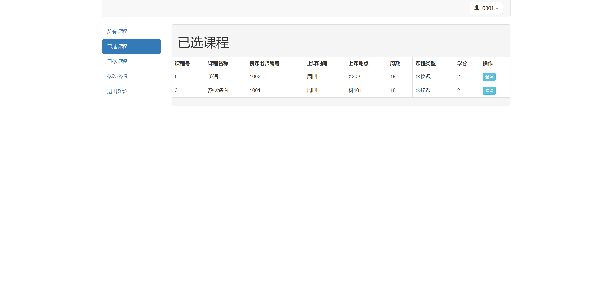
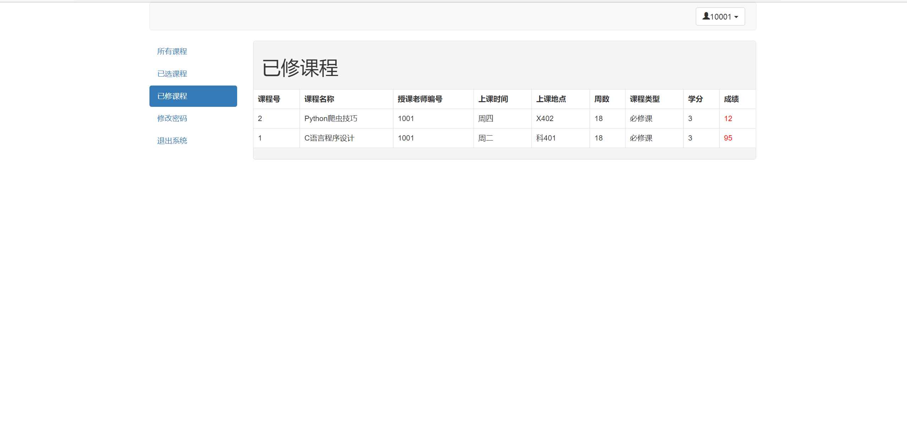

## 基于SSM框架简单的教务查询系统

###  获取sql数据库文件: 从戎源码网 (https://armycodes.com/) QQ: 386869957 QQ群: 377586148
###  所有系统地址: (https://github.com/YuLin-Coder/AllProjectCatalog) 
###  所有项目以及源代码本人均调试运行无问题 可支持远程安装部署调试、定制修改、代码讲解

## 项目介绍
基于SSM框架简单的教务查询系统，有学生、老师和管理员三个角色，主要功能如下

【学生】
学生登录后，根据学生信息，获取其已经选择的课程，和已经修完的课程
所有课程:  在这里选修课程，选好后，将会自动跳转到已选课程选项
已选课程:  这里显示的是，还没修完的课程，也就是老师还没给成绩，由于还没有给成绩，所以这里可以进行退课操作
已修课程: 显示已经修完，老师已经给成绩的课程

【教师】
教师登陆后，可以获取其授课的课程列表，并可以给已经选择该课程的同学打分，无法对已经给完分  的同学进行二次操作

【管理员】
管理员可对 教师信息、学生信息、课程信息 进行增删改查操作，管理员账户可以重置非管理员账户的密码

## 项目技术
- 编程语言：Java
- 数据库：MySQL
- 前端技术：JSP、JavaScript、bootstrap、JQuery
- 后端技术：Spring、SpringMVC、MyBatis

## 运行环境
- JDK版本：JDK1.8及以上
- 开发工具：IDEA、Ecplise、Myecplise都可以
- 数据库: MySQL5.7及以上
- Maven：maven3.0及以上

## 运行截图

